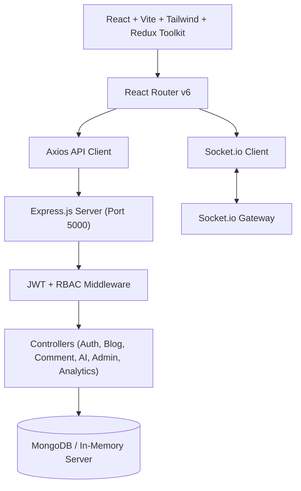

# BlogSphere 🚀

> A production-grade, full-stack MERN content publishing platform featuring AI writing assistance, real-time Socket.io discussions, creator analytics, and administrative moderation.

---

## ✨ Features

- **🎨 Modern Dark UI / UX**: Built with React 18, Vite, Tailwind CSS, and custom glassmorphism styling.
- **⚡ Real-Time Socket.io**: Live nested comments and push notifications without page refreshes.
- **🤖 Built-in AI Assistant**:
  - Instant AI article summarization
  - AI title suggestions
  - Intelligent tag recommendations
- **👥 3-Tier Role-Based Permissions (RBAC)**:
  - **Reader**: Browse feed, search, bookmark, like, and comment with nested threads.
  - **Author**: Create and edit stories with rich formatting, view personal analytics dashboards with readership trends.
  - **Admin**: System-wide moderation suite to triage reported content, feature articles, manage user roles, and control category taxonomy.
- **📊 Creator Analytics Dashboard**: Track total views, likes, follower growth, and 6-month readership trends.
- **🛡️ Zero-Config Database Fallback**: Auto-connects to local or remote MongoDB, with an automatic in-memory MongoDB fallback (`mongodb-memory-server`) and built-in database seeder.

---

## 🏗️ Architecture & Tech Stack



### Technologies Used

- **Frontend**: React 18, Vite, Redux Toolkit, React Router v6, Tailwind CSS, Lucide Icons, Axios, Socket.io-client
- **Backend**: Node.js, Express.js, Mongoose, Socket.io, JWT (`jsonwebtoken`), `bcryptjs`, Multer, Slugify
- **Database**: MongoDB (with seamless `mongodb-memory-server` fallback)

---

## 🚀 Quick Start & Local Setup

### 1. Prerequisites
- [Node.js](https://nodejs.org/) (v18 or higher)
- [Git](https://git-scm.com/)

### 2. Clone Repository
```bash
git clone https://github.com/<your-username>/Blogsphere.git
cd Blogsphere
```

### 3. Backend Setup
```bash
cd server
npm install
npm start
```
The server will run on `http://localhost:5000` and automatically seed initial data on first launch.

### 4. Frontend Setup
In a new terminal window:
```bash
cd client
npm install
npm run dev
```
The application will be live at `http://localhost:5173`.

---

## 🔑 Demo Accounts

The database comes pre-seeded with ready-to-test accounts (or use the one-click demo login buttons on the Sign In page):

| Role | Email | Password | Permissions |
| :--- | :--- | :--- | :--- |
| 👑 **Admin** | `admin@blogsphere.com` | `admin123` | Full admin moderation, user roles, bans, reports triage |
| ✍️ **Author** | `author@blogsphere.com` | `author123` | Story writing, rich editor, AI assistance, analytics dashboard |
| ✍️ **Author** | `marcus@blogsphere.com` | `author123` | Published stories and profile customization |
| 📖 **Reader** | `reader@blogsphere.com` | `reader123` | Feed discovery, bookmarks, likes, nested discussions |

---

## 📁 Project Structure

```
Blogsphere/
├── client/                     # Frontend React + Vite application
│   ├── public/
│   ├── src/
│   │   ├── components/         # Reusable UI components (blog, ai, common)
│   │   ├── pages/              # 14 Full application screens
│   │   ├── redux/              # Redux slices (auth, blogs, notifications)
│   │   ├── services/           # Axios API client & Socket.io client
│   │   ├── utils/              # Date formatting & helper functions
│   │   ├── App.jsx             # Master routing & guards
│   │   ├── main.jsx            # React root entry point
│   │   └── index.css           # Design tokens & glassmorphism utilities
│   ├── package.json
│   └── vite.config.js
│
├── server/                     # Backend Express REST API & Socket.io
│   ├── config/                 # DB connector with memory fallback
│   ├── controllers/            # Auth, Blog, Comment, User, Admin, AI
│   ├── middleware/             # JWT auth, role validation, error handling
│   ├── models/                 # Mongoose schemas (User, Blog, Comment, etc.)
│   ├── routes/                 # Express API endpoints
│   ├── seed/                   # Database seeder with realistic demo data
│   ├── socket/                 # Socket.io real-time event handlers
│   ├── package.json
│   └── server.js               # Entry point
│
├── .gitignore
└── README.md
```

---

## 📜 License
MIT License. Open-source and free to use for personal and commercial projects.
